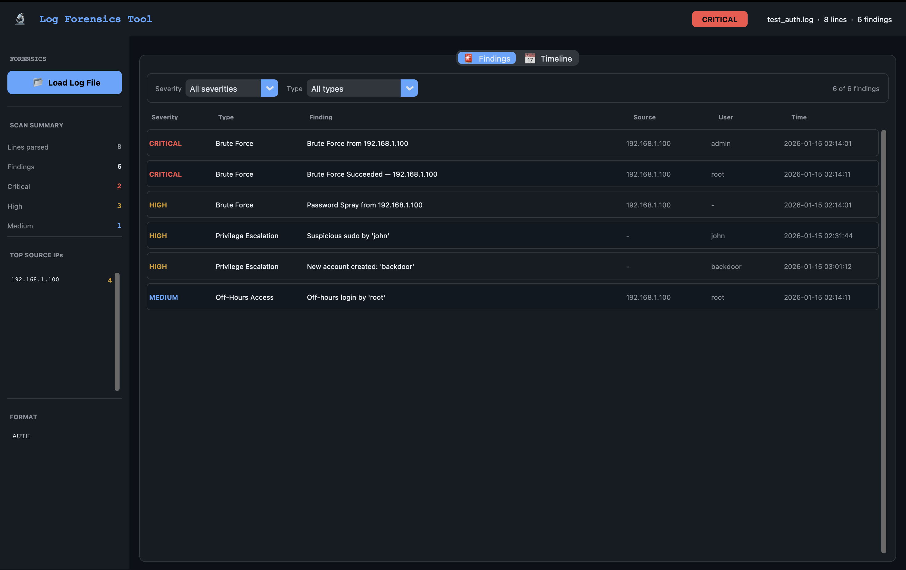
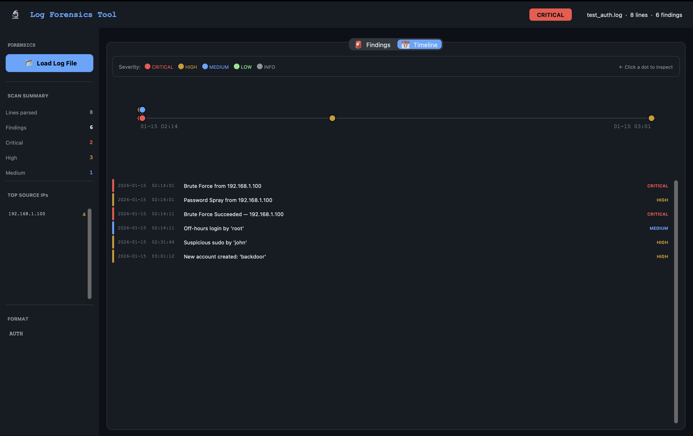
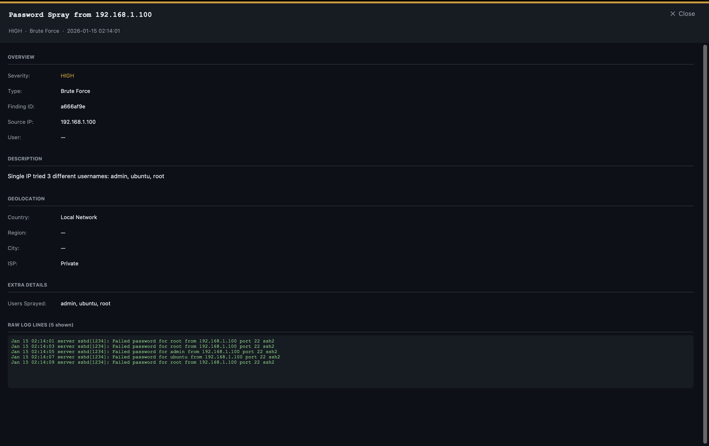

# Log Forensics Tool

A desktop forensics application that ingests system, auth, and web server logs and automatically hunts for security threats: brute force attacks, privilege escalation, port scans, off-hours logins, and HTTP attack patterns. It includes a filterable findings table, risk scoring, geolocation enrichment, and a clickable visual timeline for incident reconstruction.

---

## Features

| Feature | Detail |
|---|---|
| **Multi-format parsing** | Linux `auth.log`, Apache/Nginx access logs, generic syslog |
| **5 detection engines** | Brute force, privilege escalation, port/dir scan, off-hours login, HTTP attacks (SQLi, XSS, RCE, traversal) |
| **IP geolocation** | Auto-enriches public source IPs with country, city, ISP via ip-api.com |
| **Visual timeline** | Clickable dot-plot of all events on a time axis |
| **Findings table** | Filterable by severity and attack type |
| **Detail drawer** | Click any finding to see full context, geo info, raw log lines |
| **Risk score** | Weighted severity score with a CRITICAL/HIGH/MEDIUM/LOW/CLEAN badge |

---

## Project Structure

```
log-forensics-tool/
├── core/
│   ├── __init__.py
│   ├── parser.py       # Log parsing (auth, HTTP, syslog)
│   ├── detectors.py    # Detection engines
│   ├── geo.py          # IP geolocation
│   └── report.py       # Report aggregation
├── ui/
│   ├── app.py          # Main window
│   ├── sidebar.py      # Stats + top IPs
│   ├── findings.py     # Filterable findings table
│   ├── timeline.py     # Visual timeline
│   └── detail.py       # Finding detail drawer
├── generic/            # Legacy copies of core modules; app uses core/
├── main.py
├── requirements.txt
├── demo_images/
└── README.md
```

---

## Getting Started

```bash
git clone https://github.com/your-username/log-forensics-tool.git
cd log-forensics-tool

python -m venv .venv
source .venv/bin/activate      # Windows: .venv\Scripts\activate

python -m pip install -r requirements.txt
python main.py
```

Run `python main.py` from the repository root so imports like `core.detectors` resolve correctly. Then click **Load Log File** and open any `.log`, `.txt`, `.access`, or `.out` file.

---

## Testing With Sample Logs

You can generate sample logs for testing:

**Auth log** - create a file called `test_auth.log`:

```
Jan 15 02:14:01 server sshd[1234]: Failed password for root from 192.168.1.100 port 22 ssh2
Jan 15 02:14:03 server sshd[1234]: Failed password for root from 192.168.1.100 port 22 ssh2
Jan 15 02:14:05 server sshd[1234]: Failed password for admin from 192.168.1.100 port 22 ssh2
Jan 15 02:14:07 server sshd[1234]: Failed password for ubuntu from 192.168.1.100 port 22 ssh2
Jan 15 02:14:09 server sshd[1234]: Failed password for root from 192.168.1.100 port 22 ssh2
Jan 15 02:14:11 server sshd[1234]: Accepted password for root from 192.168.1.100 port 22 ssh2
Jan 15 02:31:44 server sudo: john : TTY=pts/0 ; PWD=/home/john ; USER=root ; COMMAND=/bin/bash
Jan 15 03:01:12 server useradd[9988]: new user: name=backdoor
```

**Apache log** - create `test_access.log`:

```
45.33.32.156 - - [15/Jan/2024:10:22:33 +0000] "GET /admin/../../../etc/passwd HTTP/1.1" 200 512
45.33.32.156 - - [15/Jan/2024:10:22:34 +0000] "GET /login?id=1' OR 1=1-- HTTP/1.1" 200 1024
45.33.32.156 - - [15/Jan/2024:10:22:35 +0000] "GET /search?q=<script>alert(1)</script> HTTP/1.1" 200 256
```

---

## Detection Engines

### Brute Force
- 5 or more SSH failures from the same IP within 60 seconds: **CRITICAL**
- Same IP targeting 3 or more different usernames: **HIGH** password spray
- Successful login within 5 minutes of repeated failures: **CRITICAL**

### Privilege Escalation
- `sudo` used with sensitive commands such as `/bin/bash`, `passwd`, or `wget`: **HIGH**
- Failed `su` attempts: **MEDIUM**
- New user or group created: **HIGH**

### Off-Hours Access
- Successful SSH login between midnight and 6am: **MEDIUM**

### Web Directory Scan
- 20 or more unique 4xx-status paths from the same IP within 2 minutes: **HIGH**

### HTTP Attack Patterns
- SQL injection patterns in URL: **CRITICAL**
- XSS payloads in URL: **HIGH**
- Path traversal such as `../` or `etc/passwd`: **CRITICAL**
- RCE indicators such as `cmd.exe`, `eval(`, or `system(`: **CRITICAL**

---

## Troubleshooting

### `ModuleNotFoundError: No module named 'core.detectors'`

This is a local project import, not a PyPI dependency. Do not fix it with `pip install detectors`.

Check that:

- You are running the app from the repository root.
- `core/detectors.py`, `core/report.py`, and `core/geo.py` exist.
- Your virtual environment has the app dependencies installed with `python -m pip install -r requirements.txt`.

Use:

```bash
python main.py
```

from inside `log-forensics-tool/`.

### Tkinter or CustomTkinter errors

`customtkinter` is installed from `requirements.txt`, but `tkinter` comes from your Python installation. If Tk fails to load, install or switch to a Python distribution that includes Tk support.

---

## Tech Stack

- **Python 3.11+**
- [`customtkinter`](https://github.com/TomSchimansky/CustomTkinter) - modern desktop UI
- `tkinter` Canvas - timeline rendering
- `urllib` - IP geolocation via the standard library
- `re`, `collections`, `datetime` - parsing and aggregation utilities

---

## Demo Images

| | |
|---|---|
|  |  |
|  |  |


---

## License

This project is intended for educational and cybersecurity learning purposes.
